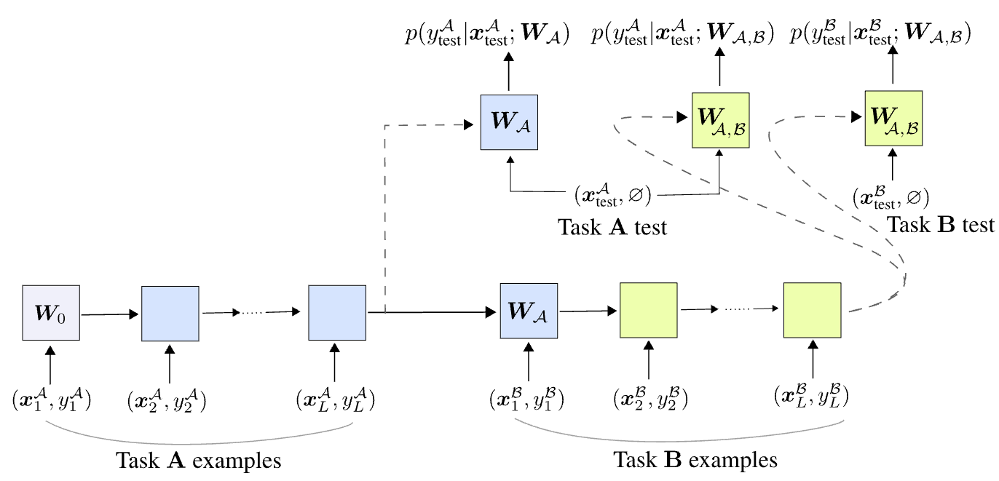

# Automated Continual Learning

This is the official code repository for the paper:

[Automating Continual Learning]() (link coming soon)


<div>

</div>    

This codebase is originally forked from [IDSIA/modern-srwm](https://github.com/IDSIA/modern-srwm)
which we modified for continual learning (also including improved practical settings for self-referential weight matrices, e.g., better initialization strategy).

NB: this is research code with many sub-optimal implementations (search for `NB:` in `main.py` for various comments).


### Acknowledgement

Our codebase also includes code from other public repositories, e.g.,
* [tristandeleu/pytorch-meta](https://github.com/tristandeleu/pytorch-meta) for standard few-shot learning data preparation/processing and data-loader implementations.
(forked and slightly modified code can be found under `torchmeta_local`)

* [khurramjaved96/mrcl](https://github.com/khurramjaved96/mrcl) for the OML baseline (Table 3).
Forked and modified code can be found under `oml_baseline_local`. We downloaded their out-of-the-box Omniglot model from their Google drive from the same repository.

* [GT-RIPL/Continual-Learning-Benchmark](https://github.com/GT-RIPL/Continual-Learning-Benchmark): this is not included here but we modified/used it to produce the results for the 2-task class-incremental setting (Table 3)

as well as other architectural implementations (currently not reported in the paper):

* [lucidrains/mlp-mixer-pytorch](https://github.com/lucidrains/mlp-mixer-pytorch) for MLP mixer.

* [yinboc/few-shot-meta-baseline](https://github.com/yinboc/few-shot-meta-baseline/blob/master/models/resnet12.py) for Res-12.

Please find LICENSE files/mentions in the corresponding directory/fileheaders.

### Requirements

The basic requirements are same as the original repository [IDSIA/modern-srwm/supervised_learning](https://github.com/IDSIA/modern-srwm/tree/main/supervised_learning).
We used PyTorch `1.10.2+cu102` or `1.11.0` in our experiments but newer versions should also work.

### Training & Evaluation 

Example training and evaluation scripts are provided under `scripts`.
Our pre-trained model checkpoints can be downloaded from this [Google drive link](https://drive.google.com/file/d/1fJJBnuxefiSNNUDVB3h-J41fa-t0youM/view?usp=sharing).


## BibTex
```
Coming soon
```
